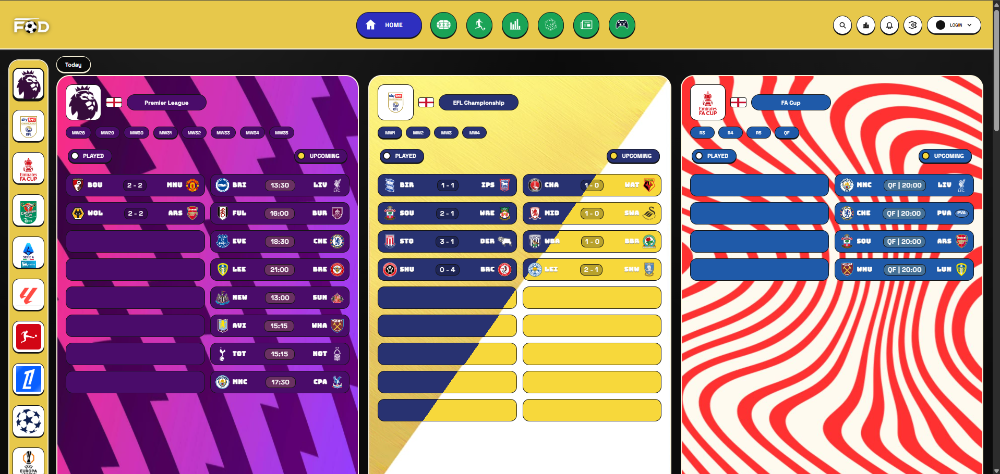

# FOD Football Project

FOD is a football web app with:

- a main desktop web app
- a separate mobile web version
- a backend for auth, account storage, and cardgame data
- a competition data API
- a marketing/dashboard view

This README is meant to help someone new understand the project fast and run it locally without needing VS Code `Go Live`.

**Preview**



**Quick Start**

You do **not** need `Go Live` for this project. The normal way to run it is through the backend server.

**1. Install backend dependencies**

```bash
cd backend
npm install
cd ..
```

**2. Start the backend**

From the project root:

```bash
npm run dev:backend
```

Or from inside `backend/`:

```bash
npm start
```

**3. Open the app**

Desktop:

```text
http://localhost:3002/frontend/index.html
```

Mobile:

```text
http://localhost:3002/mobile
```

Root:

```text
http://localhost:3002/
```

**4. Run the healthcheck**

Filesystem check:

```bash
npm run healthcheck
```

Live check while backend and DB API are running:

```bash
npm run healthcheck:live
```

**Docker**

If you want the app in containers, this repo now includes:

- `frontend/Dockerfile`
- `backend/Dockerfile`
- `db-api/Dockerfile`
- `docker-compose.yml`

Start everything:

```bash
npm run docker:up
```

Or:

```bash
docker compose up --build
```

Open:

- frontend root: `http://localhost:8080`
- desktop: `http://localhost:8080/frontend/index.html`
- mobile: `http://localhost:8080/mobile`
- backend API: `http://localhost:3002/api/health`
- DB API health: `http://localhost:3010/api/v1/health`

The frontend container proxies `/api` to the backend container, so the browser can use the app from the frontend server cleanly.

Stop everything:

```bash
npm run docker:down
```

**Project Structure**

```text
football-project/
├── frontend/                     Desktop app
├── mobile-version/               Mobile app
├── backend/                      Main backend server + SQLite auth/storage
├── db-api/                       Football data API and static data
│   ├── data/competitions/        Main structured competition JSON data
│   ├── history-data/             Table history data for leagues and cups
│   ├── comps-teamplayers-info/   Team player CSV files by competition
│   ├── database/                 DB API database docs/migrations
│   └── src/                      DB API source code
├── Dashboard-view/               Separate dashboard frontend
├── images/                       Logos, photos, trophies, flags, assets
├── news/                         News article text and images
├── pictures/                     README screenshots
├── scripts/                      Utility scripts
├── shared/                       Shared config/data
└── README.md
```

**Main Parts**

1. `frontend/`
Desktop version of the app.

2. `mobile-version/`
Mobile version of the app, built as a separate UI flow for phone-sized screens.

3. `backend/`
Express backend used for:
- login / register
- saved account data
- cardgame inventory and storage
- serving the frontend, mobile app, images, news, and data files on the backend port

4. `db-api/`
Football data layer:
- competition data
- history tables
- team player CSV files
- data API service

5. `Dashboard-view/`
Separate Vite dashboard app.

6. `images/`
Project images:
- team logos
- player photos
- trophies
- flags
- wallpapers
- assets

7. `shared/`
Shared app data, for example card prices.

**Important Data Folders**

`db-api/history-data/`
- league and cup history CSV files
- used for standings history, fixtures, and season switching

Examples:
- `db-api/history-data/premier-league-table-history/`
- `db-api/history-data/laliga-table-history/`
- `db-api/history-data/champions-league-table-history/`

`db-api/comps-teamplayers-info/`
- team player CSVs grouped by competition
- used for squad pages, player stats, and lineup-style views

Examples:
- `db-api/comps-teamplayers-info/premier-league/liverpool.csv`
- `db-api/comps-teamplayers-info/serie-A/inter.csv`
- `db-api/comps-teamplayers-info/bundesliga/bayern.csv`

`images/players-photos/`
- player photos used in squad pages, lineups, and team views

`db-api/playersinfo-index.json`
- connects teams to:
- CSV files
- player photo folders / photo paths
- special photo matching rules

**How The App Runs**

The backend serves the main app and important static files, including:

- `/frontend`
- `/mobile-version`
- `/images`
- `/news`
- `/db-api`
- `/playersinfo`
- `/comps-teamplayers-info`

So for normal testing, run the backend and open the app through `localhost:3002`.

**Root Scripts**

From the project root:

```bash
npm run dev
```

Starts:
- backend
- dashboard

Other useful scripts:

```bash
npm run dev:dashboard
npm run build:dashboard
npm run dev:db-api
```

**Extra Services**

`Dashboard-view/`
- Vite app
- default port: `3000`

`db-api/`
- competition data API
- default port: `3010`
- base path: `/api/v1`

**Backend Storage**

The backend uses SQLite for account/cardgame storage.

Main backend database code:
- `backend/database/db.js`

Example custom start:

```bash
PORT=3003 FODR_DB_PATH=/tmp/fodr.sqlite npm --prefix backend start
```

**Useful Files**

- `backend/server.js`
Main backend server.

- `frontend/js/app.js`
Desktop app entry logic.

- `mobile-version/js/app.js`
Mobile app entry logic.

- `frontend/js/modules/players.js`
Players, squads, team profiles, photo mapping.

- `frontend/js/modules/leagues.js`
League tables and season/history logic.

- `frontend/js/modules/home.js`
Home screen, fixtures, match views, lineups.

- `frontend/js/modules/news.js`
Desktop news feed and article loading.

- `db-api/playersinfo-index.json`
Links teams to squad CSVs and player photo data.

**Notes For Contributors**

- Use the backend route for normal testing, because it serves the frontend and static assets together.
- A lot of player-photo behavior depends on `db-api/playersinfo-index.json`.
- History/season data lives under `db-api/history-data/`.
- Team player CSV data lives under `db-api/comps-teamplayers-info/`.
- Mobile and desktop are separate UIs, so changes often need to be checked in both.

**Recommended Start For New Contributors**

1. Run the backend.
2. Open the desktop app on `http://localhost:3002/frontend/index.html`.
3. Open the mobile app on `http://localhost:3002/mobile`.
4. If you are working on standings or fixtures, check `db-api/history-data/`.
5. If you are working on squads or player photos, check:
   - `db-api/comps-teamplayers-info/`
   - `db-api/playersinfo-index.json`
   - `images/players-photos/`

**Current Goal Of This Repo**

The project is set up as a football platform with:

- league pages
- fixtures
- tables
- squad/team pages
- match views
- stats
- quiz
- cardgame
- news
- profile/account system
- mobile and desktop experiences
